<div align="center">

<!-- Visual Header -->


<br/>

<!-- Badges Grid -->
[](https://blueprint.hackaday.io)
[](https://github.com/Yashaswini-V21/Pay_Sentinel)
[](./tests)
[](https://python.org)
[](LICENSE)

<br/>

### *"The first fraud detection system in the world that speaks Kannada."*
**Protecting ₹4,000 Crore of small business dreams. One alert at a time.**

<br/>

[**🚀 Quick Start**](#-quick-start) &nbsp;•&nbsp;
[**🏗️ Architecture**](#-system-architecture) &nbsp;•&nbsp;
[**🧠 ML Engine**](#-how-it-works) &nbsp;•&nbsp;
[**📂 Project Structure**](#-project-structure) &nbsp;•&nbsp;
[**🧪 Testing**](#-testing)

---

</div>

## 🛡️ Why We Built This
India is witnessing the world's most successful digital payment revolution via **UPI**. However, this success has a dark side. Small merchants — the backbone of Bharat — are being targeted by sophisticated fraud syndicates.

> [!IMPORTANT]
> **The Problem:**
> - **Language Barrier:** 100% of existing fraud tools are in English. Rural merchants are left in the dark.
> - **Latency Gap:** Bank-side fraud detection takes minutes. Fraudsters vanish in seconds.
> - **Cost Barrier:** Enterprise security costs thousands of dollars. Small merchants have zero budget.

**PaySentinel** was born to bridge this gap. We built a system that doesn't just block transactions — it **explains** them to the merchant in their native tongue, for free, in under 100 milliseconds.

---

## 🥇 Competitive Analysis

Judges usually ask one question: "Why this over existing fraud tools?" This section answers that directly.

| Capability | Traditional Bank Fraud Stack | Generic SME Fraud SaaS | PaySentinel |
| :--- | :--- | :--- | :--- |
| Primary user focus | Large institutions | Online businesses | Indian small merchants (UPI-first) |
| Language accessibility | Mostly English | Mostly English | Kannada + Hindi + Tamil + Telugu + English |
| Explainability for non-technical users | Low | Medium | High (plain-language explanation + SHAP reasons) |
| Voice-based actionability | Rare | Rare | Built-in multilingual voice alerts |
| Offline fallback for alerts | Rare | Rare | Available (pyttsx3 fallback) |
| Forensic evidence output | Internal systems only | Limited exports | PDF fraud certificates + QR proof |
| Real-time simulation + stream pipeline | Internal only | Often add-on | Native Kafka + SSE support |
| Cost profile for small shops | High | Medium | Open-source and low-cost deployable |

### Strategic Differentiators
- **Bharat-first design**: Built for the exact UPI merchant segment that is underserved by English-only fraud tools.
- **Trust + action, not just score**: Detection, explanation, voice warning, and forensic report in one flow.
- **Deployability**: Works as local Flask app, containerized production stack, and stream-enabled architecture.
- **Enterprise controls**: API key protection, rate limiting, signed model cache, security headers, and rotating logs.

---

## 🏗️ System Architecture

PaySentinel is built as a high-performance, forensic-grade application with a clear separation of concerns.

```mermaid
graph TD
    subgraph "External Sources"
        A[UPI CSV Logs] --> D[Forensic Gateway]
        B[Kafka Live Stream] --> D
    end

    subgraph "PaySentinel Core (Python/Flask)"
        D --> E[Feature Engineering Engine]
        E --> F{Triple ML Ensemble}
        F --> G[Isolation Forest]
        F --> H[One-Class SVM]
        F --> I[Local Outlier Factor]
        
        F --> J[Inference Merger]
        J --> K[SHAP Explainer]
    end

    subgraph "Output Layer"
        K --> L[Regional Voice Engine]
        K --> M[Forensic PDF Generator]
        K --> N[Stark-Tech Dashboard]
        
        L --> O[Kannada/Hindi/Tamil Alerts]
        M --> P[QR-Signed Certificates]
    end

    style D fill:#0d1117,stroke:#00f5d4,stroke-width:2px
    style F fill:#0d1117,stroke:#ff7043,stroke-width:2px
    style K fill:#0d1117,stroke:#ffc107,stroke-width:2px
```



---

## 📂 Project Structure

We follow a clean, modular **Frontend-Backend Separation** designed for high-speed delivery and auditability.

```text
Pay_Sentinel/
├── src/                           # 🔧 Core Engine
│   ├── app.py                     #    Flask API Gateway & Controller
│   ├── model.py                   #    Triple ML Ensemble Core
│   ├── generate_data.py           #    Forensic Synthetic Data Generator
│   ├── pdf_report.py              #    Bilingual QR-Signed Certificates
│   ├── voice_alerts.py            #    Regional NLP Voice Engine
│   │
│   └── frontend/                  # 🎨 Modern UI Layer
│       ├── templates/             #    Index & Dashboard (Glassmorphism)
│       └── static/                #    Frontend Assets
│           ├── images/            #    HUD, Backgrounds, Section Visuals
│           └── css/               #    Global Styles & Animations
│
├── tests/                         # 🧪 Quality Assurance (99 Tests)
├── models/                        # 💾 Serialized ML Models
├── docs/                          # 📖 Enterprise Documentation
├── Dockerfile                     # 🐳 Production Containerization
└── requirements.txt               # 📦 Pinned Dependencies
```

---

## 🛠️ Tech Stack

<div align="center">

| Component | Technology | Role |
| :--- | :--- | :--- |
| **Backend** |   | API Orchestration & Security |
| **ML Engine** |   | Triple Ensemble Anomaly Detection |
| **Forensics** |   | AI Interpretability & Vision |
| **Frontend** |   | Glassmorphism & WebGL HUD |
| **Real-time** |  | High-throughput Event Streaming |
| **Linguistic** |  | Regional Multi-language Alerting |

</div>

---

## 📊 Data Flow Pipeline

The journey of a transaction from a raw log to a regional voice alert follows a strict, high-speed pipeline.

### 1. Ingestion & Sanitization
*   **Raw Data**: CSV upload or Kafka stream.
*   **Validation**: Deep check for SQLi, XSS, and mathematical anomalies (negative amounts, extreme outliers).
*   **Sanitization**: Bleach-based HTML stripping for merchant names.

### 2. Feature Engineering (~15ms)
We transform raw timestamps and amounts into **11 forensic features** including velocity engines and merchant fingerprinting.

### 3. Neural Inference (~30ms)
The heart of PaySentinel is a **weighted ensemble** of three unsupervised models:
*   **Isolation Forest (35%)**
*   **One-Class SVM (35%)**
*   **LOF (20%)**
*   **Heuristics (10%)**

### 4. Forensic Output (~50ms)
*   **Explainability**: SHAP identifies the top 4 reasons for the flag.
*   **Vocalize**: Regional voice alerts in Kannada, Hindi, or Tamil.

---

## 🧠 How It Works

| Stage | Process | Technology | Latency |
| :--- | :--- | :--- | :--- |
| **Ingest** | Stream / Upload | Flask + Kafka | 5ms |
| **Engine** | 11-Feature Vector | Pandas + NumPy | 15ms |
| **Neural** | Triple Ensemble | Scikit-Learn | 30ms |
| **Explain** | SHAP Values | SHAP Library | 35ms |
| **Alert** | Regional Voice | gTTS / pyttsx3 | <100ms |

---

## ⚡ Quick Start

### 🚀 Local Development
```bash
# Clone the vault
git clone https://github.com/Yashaswini-V21/Pay_Sentinel.git
cd Pay_Sentinel

# Install dependencies
pip install -r requirements.txt

# Ignite the engine
python src/app.py
```
> [!TIP]
> Visit `http://localhost:5000/dashboard` to experience the **Stark-Tech** command center.

---

## 🧪 Testing & Audit
We maintain a **99% test pass rate** across three specialized suites.

```bash
pytest tests/ -v --cov=.
```

---

<div align="center">

### 👨‍💻 Solo Developer & Learner
**PaySentinel** is a passion project built single-handedly for the **BLUEPRINT 2026** Hackathon. 
It represents a journey of learning **Forensic ML**, **Regional NLP**, and **High-Performance Flask**.

**#SoloHacker #BharatTech #OpenSource #FintechSecurity #MLOps**

<br/>


#### *"Protecting the backbone of Bharat's economy."*
**Made with ❤️ by a Solo Learner**

[](https://github.com/Yashaswini-V21/Pay_Sentinel)
[](https://github.com/Yashaswini-V21/Pay_Sentinel/network)

</div>
